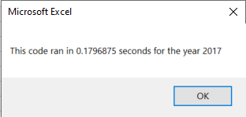

# stocks-analysis

## Overview of Project

### Purpose

###### The purpose of Module Two and the Stocks Analysis Challenge is to learn how to write and execute code in Visual Basic for Applications (VBA), how to refactor code in VBA, and the benefits of refactoring code in VBA.  For the Stocks Analysis Challenge, the original All Stocks Analysis code was refactored primarily by introducing tickerIndex as a variable. 

## Results

###### By introducing tickerIndex as a variable in the refactored code and using it to access the stock ticker index for tickers, tickerVolumes, tickerStartingPrices, and tickerEndingPrices arrays, the elapsed run time for executing the code improved by approximately 79% for both 2017 and 2018 stock data from the original script to the refactored script.


### AllStocksAnalysisRefactored
```
'1a) Create a ticker Index
    tickerIndex = 0

    '1b) Create three output arrays
    Dim tickerVolumes(12) As Long
    Dim tickerStartingPrices(12) As Single
    Dim tickerEndingPrices(12) As Single
    
    '2a) Create a for loop to initialize the tickerVolumes to zero
    For i = 0 To 11
    tickerVolumes(i) = 0
    Next i
                     
    '2b) Loop over all the rows in the spreadsheet.
    For i = 2 To RowCount
    
        '3a) Increase volume for current ticker
        If Cells(i, 1) = tickers(tickerIndex) Then
        tickerVolumes(tickerIndex) = tickerVolumes(tickerIndex) + Cells(i, 8).Value
        End If
            
        '3b) Check if the current row is the first row with the selected tickerIndex
        If Cells(i - 1, 1).Value <> tickers(tickerIndex) And Cells(i, 1).Value = tickers(tickerIndex) Then
        tickerStartingPrices(tickerIndex) = Cells(i, 6).Value
        End If
        
        '3c) Check if the current row is the last row with the selected ticker. 
	'If the next row's ticker doesn't match, increase the tickerIndex
        If Cells(i + 1, 1).Value <> tickers(tickerIndex) And Cells(i, 1).Value = tickers(tickerIndex) Then
        tickerEndingPrices(tickerIndex) = Cells(i, 6).Value
        End If
    
        '3d Increase the tickerIndex
        If Cells(i + 1, 1).Value <> tickers(tickerIndex) And Cells(i, 1).Value = tickers(tickerIndex) Then
        tickerIndex = tickerIndex + 1
        End If
        
    Next i
           
    '4) Loop through arrays to output the Ticker, Total Daily Volume, and Return
    Worksheets("All Stocks Analysis").Activate
    For i = 0 To 11
        Cells(4 + i, 1).Value = tickers(i)
        Cells(4 + i, 2).Value = tickerVolumes(i)
        Cells(4 + i, 3).Value = tickerEndingPrices(i) / tickerStartingPrices(i) - 1
    Next i
```

### All Stocks Analysis 2017 Elapsed Run Time (original script)


### All Stocks Analysis 2017 Elapsed Run Time (refactored script)


### All Stocks Analysis 2018 Elapsed Run Time (original script)


### All Stocks Analysis 2018 Elapsed Run Time (refactored script)


## Summary

###### In summary, advantages and disadvantages of refactoring code exist and in my opinion, exist on a case-by-case basis.  For example, an advantage of refactoring the All Stocks Analysis code improved the run time by approximately 79% allowing the user the benefit of time-efficiency. However a disadvantage of refactoring code would present itself if the original code did not include sufficient comments for the person refactoring the code.  Another disadvantage could exist if the person refactoring the code is not knowledgeable of how to successfully refactor the code therefore making the new code unusable.